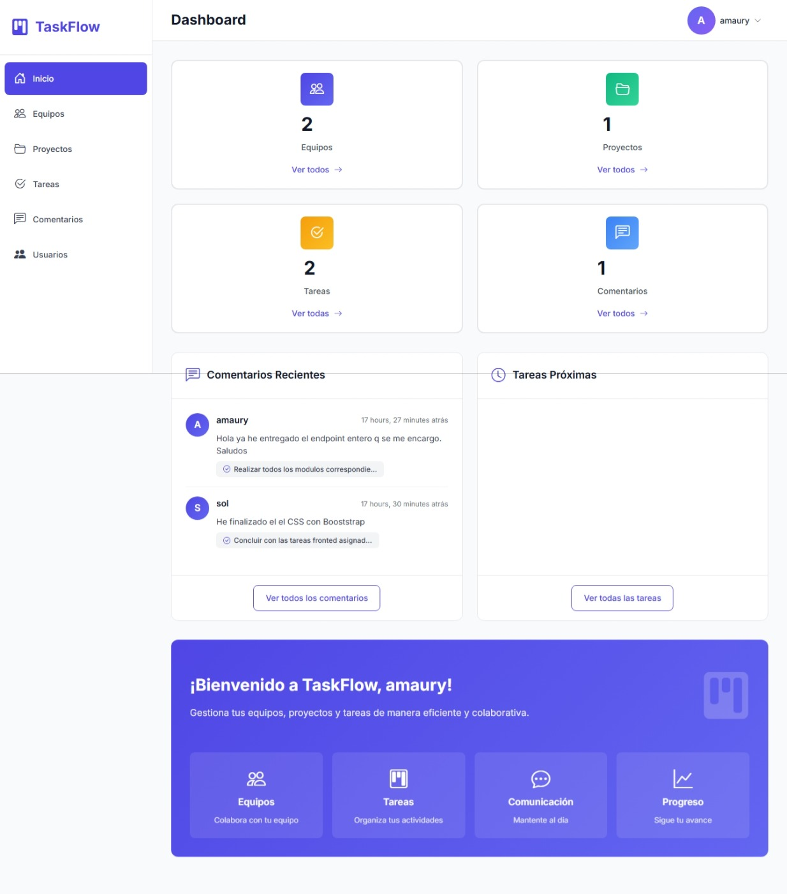
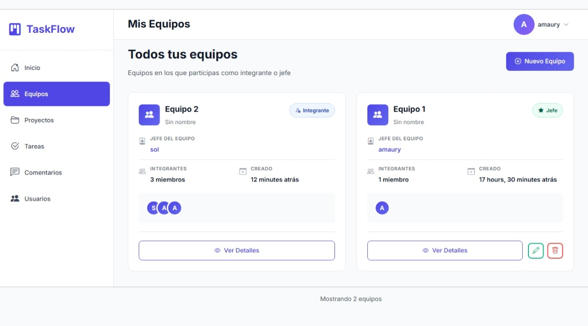
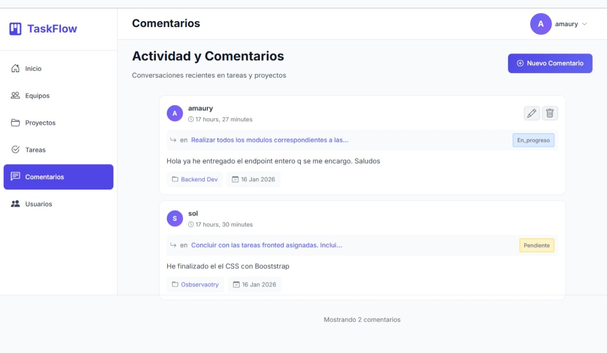
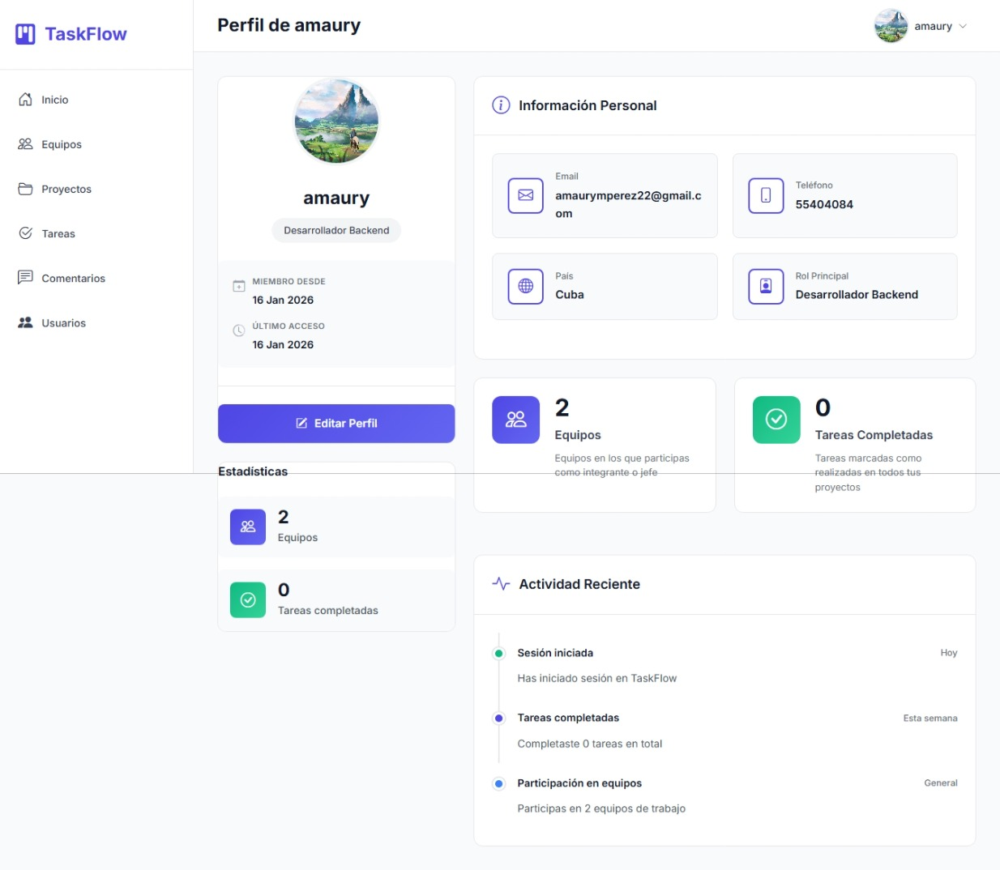

# TaskFlow

**Sistema de gestión de tareas, proyectos y equipos con control de permisos granular**

[](https://www.djangoproject.com/)
[](https://www.python.org/)
[](https://www.postgresql.org/)

🔗 **[Demo en vivo](https://task-flow-e013.onrender.com)**

---

## 📸 Screenshots

<p align="center">
  
  
</p>
<p align="center">
  
  
</p>

---

## 🎯 ¿Qué problema resuelve?

Herramientas gratuitas como Trello son demasiado simples (sin control de permisos). Herramientas como Jira son caras ($15-30/usuario/mes) y complejas.

**TaskFlow** ofrece:
- ✅ Control de acceso estricto (cada usuario solo ve sus proyectos/tareas)
- ✅ 4 roles jerárquicos (Admin, Jefe, Miembro, Invitado)
- ✅ Sistema de invitaciones por email controlado
- ✅ Notificaciones automáticas al completar tareas
- ✅ 100% gratuito y open source

**Ideal para:** Equipos de 3-20 personas que necesitan colaborar sin pagar SaaS caros.

---

## ⚡ Features principales

**Gestión colaborativa:**
- CRUD completo de proyectos, equipos y tareas
- Comentarios en tiempo real en cada tarea
- Dashboard personalizado con resumen de actividad
- Filtrado avanzado de tareas por proyecto, estado, asignado

**Seguridad y permisos:**
- Control granular basado en roles
- Solo jefes de equipo pueden invitar miembros
- Validación automática de asignaciones

**Notificaciones:**
- Emails automáticos al completar tareas (a todo el equipo), enviados vía [Resend](https://resend.com) para garantizar entrega confiable en producción (evita el bloqueo de puerto SMTP que aplican la mayoría de los proveedores de hosting)
- Sistema de invitaciones por email

---

## 🛠️ Stack tecnológico

- **Backend:** Python 3.10+ | Django 4.2
- **Base de datos:** PostgreSQL (producción) | SQLite (desarrollo)
- **Frontend:** HTML5, CSS3, JavaScript, Bootstrap 5
- **Emails transaccionales:** [Resend](https://resend.com) (API HTTPS, no SMTP)
- **Deployment:** Railway | Gunicorn
- **Otros:** Django Signals, ORM optimizado (`select_related`/`prefetch_related`)

---

## 🚀 Instalación local

### Requisitos
- Python 3.10+
- PostgreSQL 12+ (o SQLite para pruebas rápidas)
- Cuenta gratuita en [Resend](https://resend.com) (para el envío de emails)

### Setup

```bash
# Clonar repositorio
git clone https://github.com/MauRyze22/Task_Flow.git
cd Task_Flow

# Crear entorno virtual
python -m venv venv
source venv/bin/activate  # Windows: venv\Scripts\activate

# Instalar dependencias
pip install -r requirements.txt

# Configurar variables de entorno
cp .env.example .env
# Edita .env con tus datos (DB, RESEND_API_KEY, SECRET_KEY)

# Migraciones y superusuario
python manage.py migrate
python manage.py createsuperuser

# Ejecutar servidor
python manage.py runserver
```

Abre http://127.0.0.1:8000

> **Nota sobre emails:** con el plan gratuito de Resend y sin un dominio propio verificado, solo se pueden enviar correos a la dirección con la que te registraste en Resend. Para levantar el proyecto localmente basta con generar una API key en tu cuenta de Resend y usar ese mismo correo para las pruebas de invitación/notificación.

---

## 📚 Estructura del proyecto

```
Task_Flow/
├── taskflow/          # Configuración Django
├── base/             # App principal (models, views, forms)
├── templates/         # HTML templates
├── static/            # CSS, JS, imágenes
├── screenshots/       # Capturas para README
├── requirements.txt   # Dependencias
└── .env.example       # Plantilla de variables
```

---

## ⚠️ Limitaciones conocidas

- **Envío de emails en modo sandbox:** el proyecto usa el dominio de pruebas de Resend por defecto, por lo que el envío de correos (invitaciones y notificaciones) está limitado a la dirección registrada en la cuenta de Resend usada. Para producción sin esta restricción, basta con verificar un dominio propio en el dashboard de Resend (registros DNS TXT/MX/CNAME) — no requiere cambios de código.

---

## 🤝 Sobre este proyecto

Proyecto de portfolio personal para demostrar habilidades en:

✓ Autenticación y autorización con roles personalizados  
✓ Optimización de queries (N+1 problem, eager loading)  
✓ Django Signals para eventos automáticos  
✓ Integración con servicios externos de email transaccional (Resend)  
✓ Deployment en producción con PostgreSQL  

**Feedback y sugerencias son bienvenidos** → [Abrir issue](https://github.com/MauRyze22/Task_Flow/issues)

---

## 📬 Contacto

**Amaury Monteagudo** — Backend Developer

Especializado en Python, Django, APIs REST y bases de datos.

📧 amaurymonteagudop22@gmail.com  
🔗 [GitHub](https://github.com/MauRyze22) | [LinkedIn](https://www.linkedin.com/in/amaury-monteagudo-40375b3a5)

---

## 📄 Licencia

[MIT License](LICENSE) — Uso libre con atribución.

---

⭐ **Si este proyecto te fue útil, considera darle una estrella — ¡gracias!**